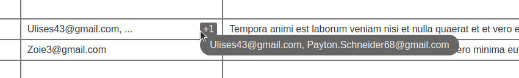
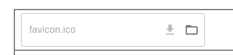

# React Components

Diverse UI Components using React Hooks, [Material UI](https://mui.com/material-ui/), and [emotion](https://emotion.sh/docs/introduction).

### Instructions

 - Just install the npm package, using:  
   `npm install @emmveqz/react-components`
 - You will need to set the package scope in your `.npmrc` file,
   like this:  
   `@emmveqz:registry=https://npm.pkg.github.com`
 - You will also need to get a github access token with `read:packages` permission.  
   You can do that [here](https://github.com/settings/tokens).  
   Then set your token at your `.npmrc` file, like this:  
   `//npm.pkg.github.com/:_authToken=YOUR_GITHUB_ACCESS_TOKEN`

### Auto Trimmed List

Pass a list of strings so it's trimmed to fit inside a component,  
adding a "rest" badge at the end.

### File Field

A File field using Material UI.  
Use the "Download" icon whenever your field has data,  
and the "Select File" icon to set/change the file.

