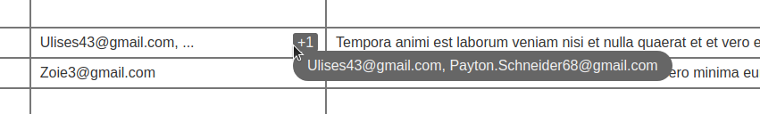
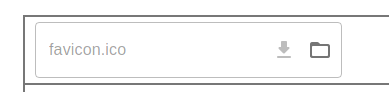
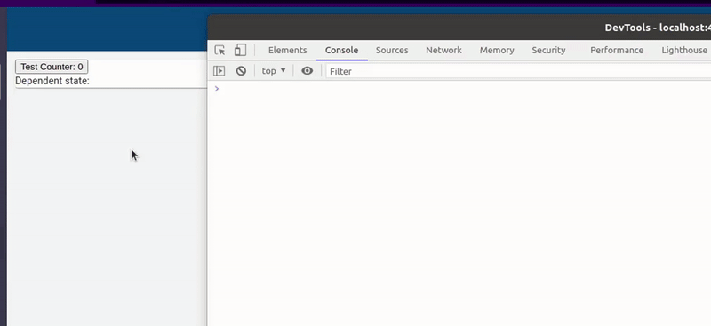

# React Components

Diverse UI Components using React Hooks, [Material UI](https://mui.com/material-ui/), and [emotion](https://emotion.sh/docs/introduction).

### Instructions

npm package: [@emmveqz/react-components](https://www.npmjs.com/package/@emmveqz/react-components)

 - Just install the npm package, using:  
   `npm install @emmveqz/react-components`

### Auto Trimmed List

Pass a list of strings so it's trimmed to fit inside a component,  
adding a "rest" badge at the end.

### File Field

A File field using Material UI.  
Use the "Download" icon whenever your field has data,  
and the "Select File" icon to set/change the file.

### [useAsyncEffect hook](./src/hooks/useAsyncEffect/README.md)

Use React's `useEffect` hook asynchronously (safely).

### [AppContext](./src/components/AppContext/README.md)

A Context Provider that can be consumed with a `useAppContext()` hook, updating its props (thus re-rendering) independently.

Check out the [example](./src/components/AppContext/example/index.tsx)

### [useExternalScript hook](./src/hooks/useExternalScript/)

Load an external script asynchronously, and safely wait for its readiness state.
